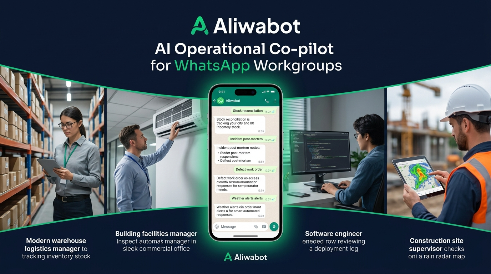
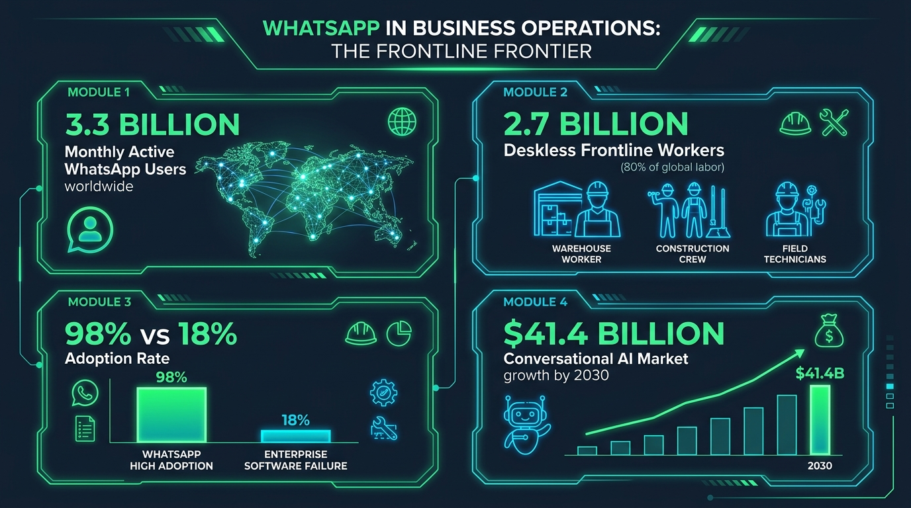
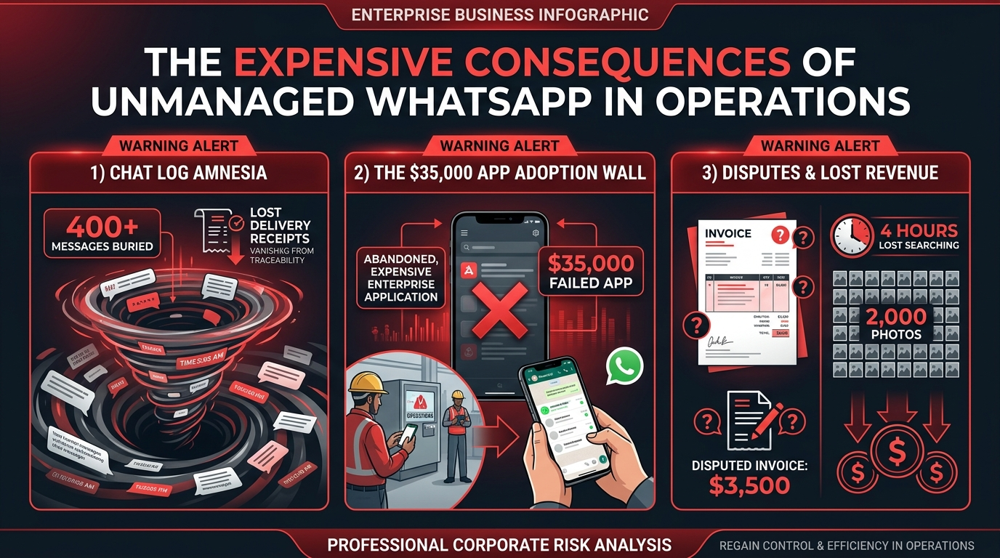
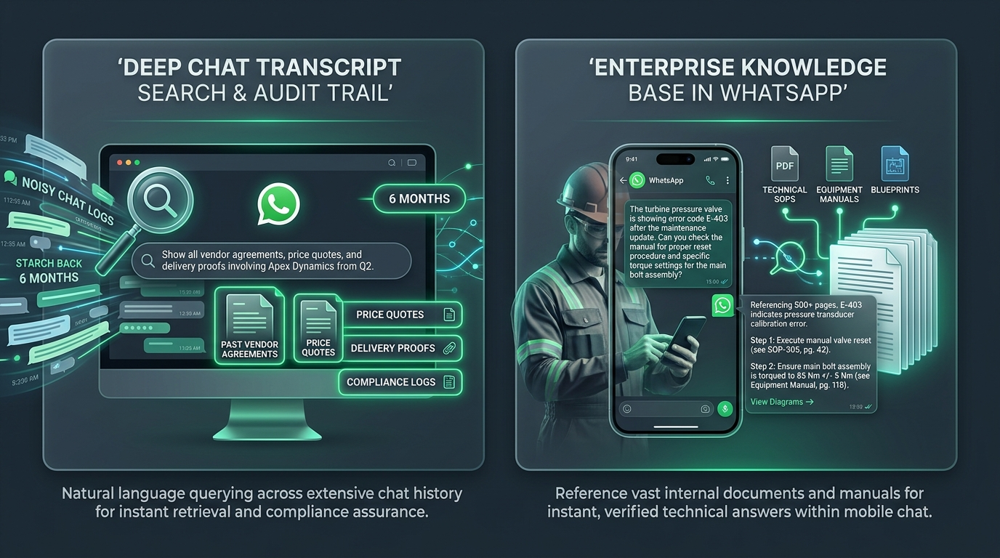
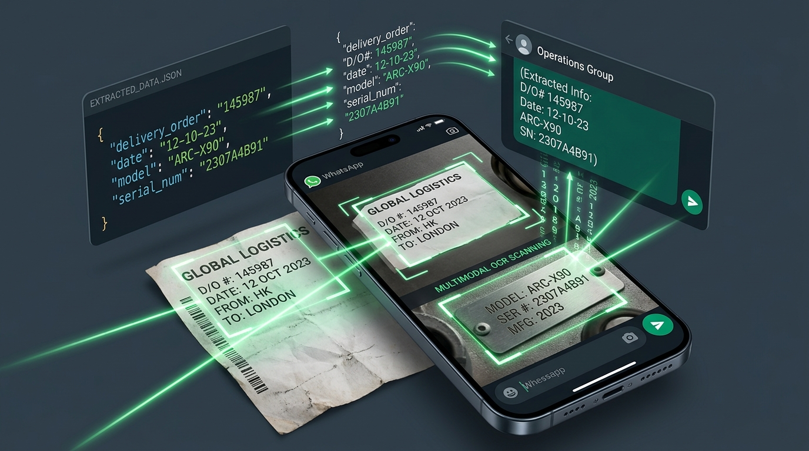
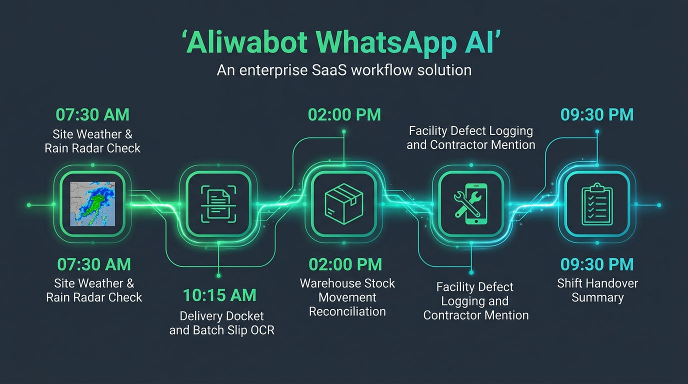
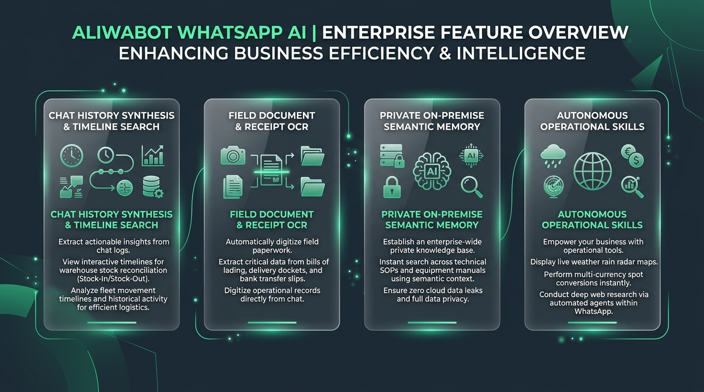
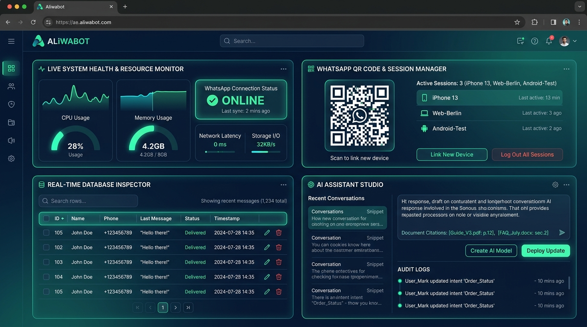
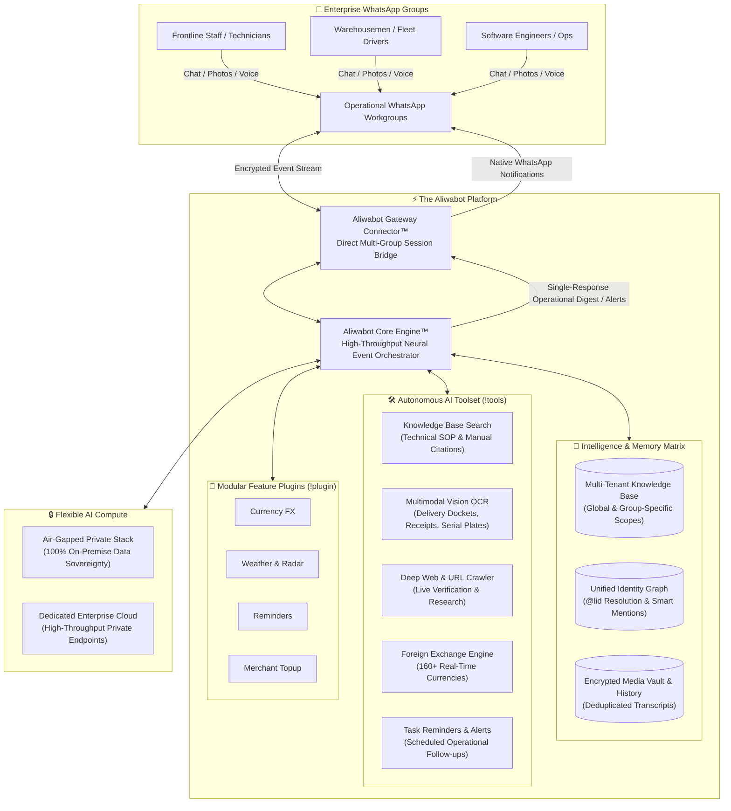

<div align="center">

# 🤖 Aliwabot
### *The Autonomous, Privacy-First AI Operational Co-Pilot for WhatsApp Workgroups*

[](#-the-aliwabot-engine-architecture)
[](#-enterprise-privacy--data-sovereignty)
[](#-act-ix-the-commercial-math--as-a-service-roi)
[](#-act-iii-the-two-killer-superpowers-transcript-search--enterprise-knowledge-base)

<br/>



<p align="center">
  <b>Stop fighting human nature. Don't force your frontline teams to learn another complex software.</b><br/>
  Transform the messy WhatsApp groups your staff already use 50 times a day into structured, searchable, and auditable operational hubs.
</p>

---

[Market Stats](#-act-i-the-33-billion-market-reality) • 
[The 7:45 AM Breakdown](#-act-ii-the-745-am-breakdown) • 
[Superpowers (KB & Transcripts)](#-act-iii-the-two-killer-superpowers-transcript-search--enterprise-knowledge-base) • 
[Multimodal OCR](#-act-iv-multimodal-document--receipt-ocr-in-action) • 
[24-Hour Walkthrough](#-act-v-24-hours-in-the-life-of-an-aliwabot-powered-operation) • 
[Industry Scenarios](#-act-vi-deep-dive-across-5-operational-frontlines) • 
[Web Dashboard](#-act-vii-the-enterprise-command-center-web-dashboard--ai-studio) • 
[Architecture](#-act-viii-the-aliwabot-engine-architecture) • 
[Commercial ROI](#-act-ix-the-commercial-math--as-a-service-roi) • 
[Command Suite](#-command-suite)

---

</div>

<br/>

## 📈 Act I: The 3.3 Billion Market Reality

Why build operational intelligence inside WhatsApp instead of asking workers to download another mobile app? **The data tells an undeniable story:**



<br/>

### 🌐 1. Global Dominance & Engagement
| Global Operational Metric | Verified Statistic | Visual Scale & Penetration |
| :--- | :--- | :--- |
| **Monthly Active Users (MAU)** | **3.3+ Billion** | `████████████████████` *1 in every 2.4 humans on Earth* |
| **Daily Active Users (DAU)** | **2.3+ Billion** | `██████████████░░░░░░` *70% of user base opens WhatsApp daily* |
| **Daily Message Volume** | **140+ Billion** | `████████████████████` *#1 dominant channel in 100+ nations* |
| **Active Business Users** | **760+ Million** | `██████████░░░░░░░░░░` *Monthly active business accounts* |

---

### 🏗️ 2. The 80% "Deskless Workforce" Paradox
> **Over 80% of the world’s working population (2.7 Billion frontline workers)** operates without a desk—in warehouse bays, construction sites, commercial plant rooms, and delivery vehicles. 
> 
> Yet, less than **1% of historical enterprise software venture capital** was designed for mobile frontline workers. Traditional ERP, CMMS, and ticketing apps fail on the ground because field staff refuse to navigate complex multi-screen forms.

```
Frontline Software Adoption Rate Reality:
WhatsApp Group Chats:    ████████████████████  98%  (Familiar, instant, zero learning curve)
Dedicated ERP/CMMS Apps: ███░░░░░░░░░░░░░░░░░  18%  (High friction, complex logins, abandoned)
```

* **The $41.4 Billion Frontline Opportunity**: The global Conversational AI market is projected to reach **$41.39 billion by 2030** (23.7% CAGR, Grand View Research). Frontline automation—bringing intelligence directly to the chat interfaces field crews already trust—is the highest-ROI frontier in enterprise technology.

---

## ⚡ Act II: The 7:45 AM Breakdown

Every operations manager, site superintendent, and business owner knows this exact feeling:

> **It’s 7:45 AM. Your phone is already vibrating across your desk with 349 unread messages across 14 different WhatsApp workgroups.**

* A warehouse forklift operator drops a photo of crumpled boxes: *"Received Bay 3, some damaged."* No item SKU, no quantity, no timestamp.
* A duty building technician reports an error code on a 20-ton chiller without knowing the reset procedure.
* A client claims they never approved a $4,200 change order that was discussed in the group three months ago.
* A cross-border supplier messages asking for payment confirmation, while your finance manager is calculating exchange rates in Excel.
* A developer dumps a 60-line terminal stack trace into the tech chat during an outage.

### 🚨 The Expensive Consequences of Unmanaged WhatsApp



<br/>

> [!CAUTION]
> ### 💸 The Real Cost of Doing Nothing (Why Businesses Lose Thousands Monthly)
> When operational WhatsApp groups are left unmanaged, businesses bleed time, money, and accountability across three predictable failure modes:

#### 1. 🌀 Warning Alert: Chat Log Amnesia (The 400-Message Scroll Abyss)
* **The Ground Reality**: After 400 messages in a single shift, critical instructions, delivery notes, and gate pass codes vanish into the scroll abyss.
* **The Cost**: Supervisors and dispatchers waste **10 to 15 hours every week** manually scrolling, re-asking questions, and chasing updates that were already sent hours ago.
* **The Risk**: Critical safety notices and urgent client changes get completely overlooked in the chatter.

#### 2. 🧱 Warning Alert: The $35,000 "App Adoption Wall" (Failed Digital Rollouts)
* **The Ground Reality**: Management spends **$35,000+** purchasing and rolling out a dedicated mobile CMMS, ERP, or project management platform. Three weeks later, the technicians, forklift drivers, and external subcontractors stop logging into it and secretly revert to WhatsApp.
* **The Cost**: Massive software licensing waste, zero frontline adoption, and management remains completely disconnected from daily field reality.
* **The Solution**: Don't force workers over the adoption wall. **Bring the intelligence to WhatsApp.**

#### 3. 💥 Warning Alert: Disputes & Lost Revenue (The $3,500 Write-Off)
* **The Ground Reality**: A subcontractor or supplier insists: *"I posted the signed delivery docket in the WhatsApp group last Tuesday!"*
* **The Cost**: Searching through 2,000 unorganized photos takes **4 hours of frantic searching**—and when the docket can't be found in time, you end up eating a **$3,500 replacement cost** or paying an avoidable delay penalty.
* **The Solution**: Verifiable, timestamped **instant OCR text extraction** and automated audit logging on every document shared.

---

## 🔍 Act III: The Two Killer Superpowers — Transcript Search & Enterprise Knowledge Base

Instead of forcing your staff into another complex software tool, Aliwabot equips your WhatsApp groups with two factual enterprise capabilities that eliminate operational friction:



<br/>

### 1. 🗄️ Deep Chat Transcript Search & Audit Trail (`!history`)
WhatsApp's built-in search is primitive: it only finds exact keyword matches on your local phone, fails completely if a teammate used a slightly different word, and shows nothing if you joined the group after the message was sent.

Aliwabot maintains a **tamper-proof, structured history ledger** across all operational groups and DMs:
* **Permanent Chat Transcript & Media Capture**: Captures every message, document, and media file sent across project groups.
* **Natural Language Historical Querying**: Query across months of messy chat history:
  * *"When did Apex Dynamics agree to replace the faulty batch of pressure valves?"*  
    $\rightarrow$ **Found:** June 14, 10:22 AM, confirmed by `@David_Apex`.
  * *"What was the agreed price quote for the 500m armored cable?"*  
    $\rightarrow$ **Found:** $4.20/meter, quoted by `@Sarah_Procurement` on July 3.
  * *"List all site incidents reported in Building B during August."*  
    $\rightarrow$ **Found:** 3 incidents (pipe leak Aug 4, tripping breaker Aug 12, gate sensor Aug 28).
* **Automated Background Retention Policies**: Configure automated retention schedules (e.g., retain 90 days, archive older files) with **inode hard-link deduplication safety**, preventing accidental deletion when multiple chats reference the same media file.
* **Legal-Grade Audit Exports**: Export complete timestamped transcripts directly to file or deliver to a destination chat when an audit or dispute arises.

---

### 2. 📚 Multi-Tenant Enterprise Knowledge Base (Local RAG)
Frontline workers lose hours waiting for senior engineers or managers to answer repetitive technical questions—or worse, they guess and break expensive equipment.

Aliwabot turns your WhatsApp chat into a **24/7 technical expert** by indexing your company's actual documentation:
* **Multi-Tenant Scope Isolation**:
  * **Global Scope (`KBScope.GLOBAL`)**: Company-wide Standard Operating Procedures (SOPs), equipment OEM manuals, and HR/HSE policies accessible across all groups.
  * **Chat Scope (`KBScope.CHAT`)**: Confidential project drawings, contractor scopes of work, and specific site agreements accessible **only within that specific WhatsApp group**.
* **Instant, Verified Citations Directly in Chat**: A field technician on site asks:  
  `@Aliwabot the turbine pressure valve is showing error code E-403 after maintenance. What is the reset procedure and specific bolt torque?`  
  Aliwabot cross-references your uploaded technical manuals in 2 seconds and responds:  
  `📖 Verified Technical Response (via SOP-305 & Equipment Manual pg. 118):`<br/>
  `• E-403 indicates a pressure transducer calibration error.`<br/>
  `• Step 1: Execute manual valve reset (see SOP-305, pg. 42).`<br/>
  `• Step 2: Ensure main bolt assembly is torqued to 85 Nm +/- 5 Nm (Equipment Manual, pg. 118).`
* **Zero Hallucination Guarantee**: If the answer is not present in your verified technical library, the engine states it clearly rather than guessing.

---

## 👁️ Act IV: Multimodal Document & Receipt OCR in Action

Paper delivery orders, handwritten slips, and equipment tags are the lifeblood of field operations—and the #1 source of lost data:



<br/>

### How It Works in WhatsApp:
1. **Snap & Send**: Any team member takes a smartphone photo of a physical delivery order, crumpled weighbridge ticket, or equipment serial plate and posts it to the group.
2. **Instant Optical Extraction**: Powered by pluggable optical vision models (including local air-gapped vision models like Ollama `llama3.2-vision` / `qwen2.5-vl` or high-throughput OCR providers), Aliwabot parses the image in seconds.
3. **Structured Verification**: The engine extracts DO numbers, quantities, dates, serial tags, and line items, echoing them into the chat and saving them permanently to the operational ledger.
4. **Interactive AI Tool (`ocr_extract`)**: Reply to any previously sent photo or PDF and ask: *"@Aliwabot extract the total cement volume and slump test rating from this docket"* $\rightarrow$ immediate structured answer.

---

## ⏱️ Act V: 24 Hours in the Life of an Aliwabot-Powered Operation

Here is how Aliwabot powers an enterprise's daily operational rhythm across multiple departments without anyone ever leaving WhatsApp:



<br/>

### 🌅 07:30 AM — The Engineering Site: Technical Briefing & SOP Lookup
* **The Situation**: Technicians are preparing to service a 500kVA backup diesel generator before a hospital power changeover.
* **The Action**: The lead technician asks the group:  
  `@Aliwabot what is the pre-start oil pressure threshold and priming sequence for Generator Set G-02?`
* **The Result**: In 2 seconds, Aliwabot cites the OEM technical manual:  
  `📖 Generator G-02 Pre-Start Protocol (O&M Manual Sec. 4.2):`<br/>
  `• Minimum oil pressure: 280 kPa at idle.`<br/>
  `• Priming sequence: Activate auxiliary fuel pump for 30s until return line sight glass is bubble-free.`  
  *Value Delivered: 100% compliance with manufacturer safety specifications; zero guessing.*

---

### 📦 10:15 AM — The Warehouse: Delivery Docket & Slip OCR
* **The Situation**: A haulage truck arrives at Bay 4 carrying 18 steel structural beams. The driver hands a physical Delivery Order (DO) to the forklift driver.
* **The Action**: The forklift driver snaps a photo with his phone and posts it to the warehouse WhatsApp group.
* **The Result**: Aliwabot's vision engine instantly scans the image and posts a verified receipt card:  
  `📄 Delivery Docket Verified [DO-99214]:`<br/>
  `• Supplier: Apex Steel Industries`<br/>
  `• Item: Universal Beams UB-305x165 (Grade S355JR)`<br/>
  `• Quantity: 18 Beams (Total Net Weight: 14,240 kg)`<br/>
  `• Status: Logged to Inward Inventory Record.`  
  *Value Delivered: Zero manual typing errors, instant audit trail, and proof of receipt permanently logged.*

---

### 📊 02:00 PM — The Operations Desk: Natural Language Inventory Search
* **The Situation**: The logistics coordinator receives an urgent call from a major client asking if their pallet shipment has dispatched.
* **The Action**: Instead of calling 4 warehouse workers on the radio, the coordinator asks the group:  
  `@Aliwabot summarize stock movements for Bay 4 today`
* **The Result**: Aliwabot analyzes all morning chat messages and outputs a structured delta table:  
  `📦 Inventory Movement Summary — Bay 4 (Today):`<br/>
  `• Inward: 18 Universal Beams (DO-99214 via Apex Steel @ 10:15 AM)`<br/>
  `• Outward: 6 Pallets Grade-A Timber dispatched on Truck B-9021 @ 11:40 AM`<br/>
  `• Returned: 2 damaged crates SKU-402 staged for supplier inspection.`  
  *Value Delivered: 4-second instant answer. Client impressed. Zero radio interruptions.*

---

### 🏢 05:45 PM — Commercial Facilities: Defect Logging & Smart Dispatch
* **The Situation**: A security guard patrolling the 8th floor of an office tower spots water leaking from an overhead fan coil unit (FCU) near the server room.
* **The Action**: The guard snaps a photo of the leaking ceiling and serial tag and posts it: *"Water dripping near server room door."*
* **The Result**: Aliwabot registers the defect, cross-references building equipment records, and triggers a native audible `@mention` on the duty HVAC contractor's phone:  
  `🚨 Defect Ticket #284 Logged — FCU-08 Water Ingress`<br/>
  `• Asset: Daikin FCU Unit #08-B (Server Room Corridor)`<br/>
  `• Severity: HIGH (Proximity to electrical riser)`<br/>
  `• Action Assigned: @Contractor_Rahman please inspect condensate drain pan immediately.`  
  *Value Delivered: Instant push notification to the right specialist. No forgotten tickets. Server room protected.*

---

### 🌙 09:30 PM — The Shift Handover: Automated Executive Digest
* **The Situation**: The day shift is clocking out. The night shift supervisor needs to know exactly what remains pending across 12 different mechanical and logistics tasks.
* **The Action**: The outgoing supervisor types:  
  `!summary shift`
* **The Result**: Aliwabot scans the entire 12-hour chat transcript and generates a complete shift handover report categorized into Resolved Items, In-Progress Works, and High-Priority Alerts.  
  *Value Delivered: 45 minutes of manual report typing eliminated every evening.*

---

## 🏭 Act VI: Deep Dive Across 5 Operational Frontlines



---

### 🚚 1. Logistics, Warehousing & Fleet Operations
* **Stock In / Stock Out Chat Reconciliation**: Floor workers post quick notes as they load and unload trucks. Aliwabot reconstructs the movement log on demand, matching shipments against delivery dockets.
* **Driver & Fleet Movement Timeline Search**: Ask `@Aliwabot where is Truck 14?` $\rightarrow$ The engine parses customs checkpoint messages, driver location shares, and highway delay notices to give you an exact chronological journey timeline.
* **Mobile Bill of Lading & Weighbridge OCR**: Instant text extraction from crumpled delivery notes, customs stamps, and scale receipts.

---

### 💻 2. Working Tech Teams, IT Operations & DevOps
* **Automated Asynchronous Standup Digests**: Hybrid and remote engineering teams post daily bullet points across time zones. Aliwabot compiles an executive summary highlighting finished PRs, code reviews, and critical blockers.
* **Production Outage Incident Timeline Logging**: During a critical server downtime, engineers dump error stack traces, curl outputs, and mitigation notes into the chat. Afterward, typing `!incident summary` generates a complete, timestamped post-mortem report ready for stakeholders.
* **Internal Architecture & API Querying**: Ingest internal technical documentation, deployment guides, and API schemas. Engineers can ask `@Aliwabot what is the rate limit on our v2 webhook?` and receive exact answers with citations.

---

### 🛍️ 3. Online Businesses, Social Commerce & Sourcing
* **Real-Time Cross-Border FX Sourcing (`!fx`)**: Negotiate wholesale prices with overseas manufacturers across borders. Type `!fx 25000 rmb to sgd` or ask naturally for live spot rates across 160+ fiat currencies with 1-hour caching and provider fallback.
* **Bank Transfer & Payment Receipt OCR Verification**: Wholesale customers send screenshots of bank transfers or QR payments. Aliwabot scans the image, extracts the Transaction Reference Number, timestamp, and amount, preventing duplicate or forged payment slips.
* **Product Catalog & Wholesale FAQ**: Instant answers to customer inquiries regarding container volume capacities, wholesale tier pricing, and warranty terms.

---

### 🏢 4. Facilities Management & Building Maintenance
* **Photo-to-Work-Order Defect Logging**: Technicians snap photos of leaking valves, tripped breakers, or broken pumps. The bot logs the defect, tags the contractor with an audible `@mention`, and tracks resolution time.
* **Equipment Manual & Error Code Semantic Lookup**: Ingest chiller, elevator, generator, and fire system manuals into Aliwabot's semantic memory. A junior technician asks `@Aliwabot error code E-14 on Daikin VRV outdoor unit?` and receives step-by-step diagnostic guidance.
* **Shift Handover Reports**: Instant shift change summaries preventing miscommunication between day and night maintenance crews.

---

### 🏗️ 5. Construction Sites & Civil Engineering Projects
* **Concrete Batch Ticket & Slump Test OCR**: Instant data extraction from batch plant delivery dockets (batch time, concrete grade, slump, volume in m³) as the mixer arrives at the site gate.
* **Subcontractor Accountability & `@lid` Resolution**: The engine maps contractor identities even when WhatsApp masks their phone numbers behind privacy tokens, ensuring every instruction has a permanent paper trail.
* **Weather & Environmental Safety Gates (`!weather`)**: Optional rain radar map snapshots and localized precipitation forecasts for outdoor work safety.

---

## 🖥️ Act VII: The Enterprise Command Center — Web Dashboard & AI Studio

Aliwabot is not an opaque terminal script. It provides operations directors with a full-featured browser-based command center at `/dashboard`:



<br/>

### Key Control Plane Capabilities:
1. **Live System Health & Resource Monitor**: Real-time visibility into CPU usage, memory consumption, disk space, and WhatsApp gateway connection status.
2. **WhatsApp QR Code & Session Hot-Swap**: Link devices, back up active sessions, and switch WhatsApp phone numbers seamlessly directly in the browser—with zero server restarts or terminal commands.
3. **Real-Time Database Inspector**: A read-only SQL table explorer with search filtering, sticky headers, and one-click CSV export to audit contacts, settings, and chat logs.
4. **Isolated Browser AI Assistant Studio**: A dedicated, browser-native AI assistant interface that allows managers to query the Knowledge Base, inspect server transcripts, and review system logs—with **zero blast radius** on the live WhatsApp bot runtime.
5. **Session Backup & Restore**: One-click encrypted ZIP backups of system configurations, session data, and database ledgers with type-"RESTORE" safety confirmation.

---

## 📐 Act VIII: The Aliwabot Engine Architecture

Aliwabot is built as an enterprise-grade, event-driven operational intelligence platform designed for absolute confidentiality, speed, and reliability.



---

## 🛡️ Enterprise Privacy & Data Sovereignty

| Feature | Consumer Chatbots / Cloud SaaS | **Aliwabot Solution** |
| :--- | :---: | :---: |
| **Data Residency** | ❌ Sent to third-party US cloud | 🛡️ **100% On-Premise / Firewalled** |
| **Meta Messaging Fees** | 💸 High per-message cloud fees | 🆓 **Zero Meta Fees (Direct Connector)** |
| **Group Chat Integration** | ❌ Restrictive / Bot must be invited | 👥 **Native Multi-Group Participant** |
| **Document Confidentiality** | ❌ Blueprints/receipts stored on SaaS | 🔒 **Encrypted Local Storage** |
| **Air-Gapped Deployment** | ❌ Not available | 🏢 **Full Local Server Support** |

---

## 💼 Act IX: The Commercial Math & "As-a-Service" ROI

Investing in Aliwabot delivers immediate, measurable bottom-line returns:

### 1. Hard Return on Investment (ROI)
* **Supervisor Administrative Savings**: Eliminating 10–15 hours weekly spent manually transcribing and compiling chat reports saves an estimated **$1,200 to $2,000 per supervisor monthly**.
* **Dispute & Rejected Material Prevention**: In logistics and construction, a single disputed delivery docket or rejected batch costs **$1,500 to $5,000**. Having a permanent, timestamped OCR log in WhatsApp eliminates disputes before they escalate.
* **Zero Software Training Costs**: 100% of employees already know how to use WhatsApp. Zero budget spent on software onboarding, user licenses, or adoption training.

### 2. Commercial Packaging Models

#### A. Managed Operational Co-Pilot (Turnkey Retainer)
* **Target Audience**: Facility management agencies, mid-sized builders, warehouse operators, e-commerce distributors.
* **Deployment**: Hosted on a dedicated private virtual machine or on-premise edge appliance.
* **Pricing Structure**:
  * **Onboarding & Manual Ingestion**: One-time setup ($500 – $1,200).
  * **Monthly Retainer**: **$150 – $350 / month per active operational group or site**.
  * **Zero Variable Costs**: No per-message API bills; unlimited team members and messages.

#### B. Air-Gapped Private Enterprise Edition
* **Target Audience**: Critical infrastructure, defense contractors, government-linked entities.
* **Deployment**: 100% on-premise execution on local enterprise hardware with local neural models.
* **Pricing Structure**: **Enterprise license + customized integration & maintenance retainer**.

---

## 🎮 Command Suite

| Command | Usage | Factual Description |
| :--- | :--- | :--- |
| `!kb` | `!kb query <question>` | Queries indexed technical SOPs, equipment manuals, and blueprints (global or group-scoped). |
| `!summary` | `!summary [shift\|bay3\|truck12]` | Reconstructs conversation history into a structured operational digest. |
| `!ocr` | `!ocr` *(reply to photo/PDF)* | Extracts verbatim text and numbers from delivery dockets, slips, or serial tags. |
| `!plugin` | `!plugin enable/disable <name>` | Toggles modular plugins (`currency`, `weather`, `reminder`, `topup`) per chat or globally (`--global`). |
| `!history`| `!history [stats\|search\|purge]` | Inspects encrypted media archives and audit trail retention policies. |
| `!fx` | `!fx <amount> <from> to <to>` | Live currency spot rate conversion across 160+ fiat currencies. |
| `!s` | `!s <query>` | Deep web research for port notices, customs tariffs, or technical datasheets. |
| `!url` | `!url <link>` | Synthesizes technical articles, supplier catalogs, or regulatory updates. |
| `!tools` | `!tools [on\|off]` | Enables autonomous multi-step tool execution in the group. |
| `!flush` | `!flush context` | Clears short-term conversational context to reset discussion focus. |
| `!help`  | `!help` | Dynamic menu showing all active operational skills. |

---

<div align="center">
  <sub>Engineered for demanding, real-world operational environments.</sub><br/>
  <b>© 2026 Aliwabot Project. All rights reserved.</b>
</div>
