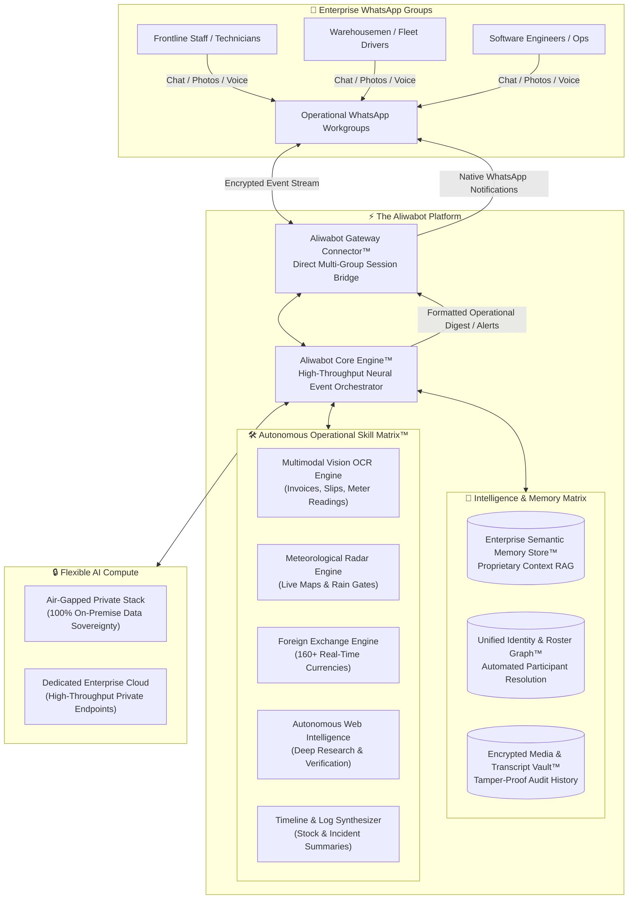
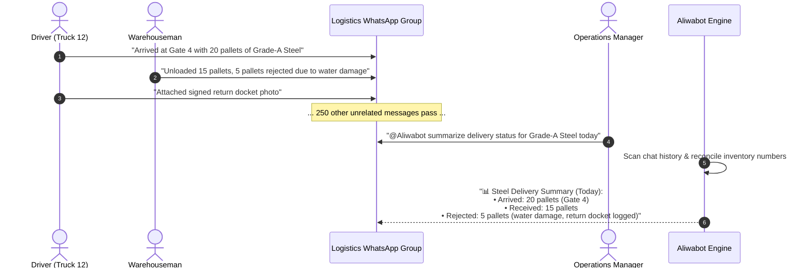

# 🤖 Aliwabot
### *The Autonomous, Privacy-First AI Operational Co-Pilot for WhatsApp Workgroups*

 

  <b>Transform noisy WhatsApp group chats into structured, auditable, and intelligent operational hubs.</b> 
  Instant Chat History Synthesis • Warehouse Stock Reconciliation • Fleet Movement Search • Defect Work Orders • Multimodal Document OCR • Live Rain Radar Maps • Private Semantic Memory

---

[The Core Problem](#-the-operational-challenge) • 
[Real-World Scenarios](#-built-for-high-velocity-operational-teams) • 
[Proprietary Architecture](#-the-aliwabot-engine-architecture) • 
[Core Capabilities](#-flagship-operational-capabilities) • 
[Commercial Deployment](#-commercial-as-a-service-deployment) • 
[Command Suite](#-command-suite)

---

 

## ⚡ The Operational Challenge

Every modern organization runs its frontline operations on **WhatsApp**:
* Warehousemen report daily stock movements.
* Technicians post photos of leaking air conditioning units.
* Site supervisors coordinate concrete trucks and crane lifts.
* Software engineers coordinate live server outages and deployments.
* Overseas buyers negotiate wholesale pricing with foreign suppliers.

### The Breakdown:
1. **The App Adoption Wall**: Management tries to enforce complex project management apps or ticket systems, but field crews, drivers, and subcontractors refuse to adopt them. They take a photo, send a quick message in WhatsApp, and move on.
2. **Chat Log Amnesia**: After 400+ messages in a single shift, critical instructions, delivery notes, and defect photos get buried. Searching through weeks of chat history to reconcile inventory or verify a delivery is impossible.
3. **Zero Accountability & Anonymity**: Messages can be deleted, tasks go unacknowledged, and masked WhatsApp IDs make it difficult to verify who gave an order.

> **The Aliwabot Mission:**  
> *"Don’t force your teams to adopt another app they'll abandon. Bring enterprise AI intelligence, automatic timeline reconstruction, instant document OCR, and technical knowledge search directly to the WhatsApp groups they already use."*

---

## 🏭 Built for High-Velocity Operational Teams

---

### 🚚 1. Logistics, Warehousing & Fleet Operations
* **Chat History Stock Reconciliation**: Warehouse floor workers and suppliers dump quick updates throughout the day:
  > *"Received 45 cartons SKU-889 Bay 3"*  
  > *"Dispatched 12 pallets of Grade A timber to Tuas"*  
  > *"Returned 5 damaged boxes of SKU-104"*
  * **The Aliwabot Action**: A supervisor simply types:  
    `@Aliwabot summarize stock-in and stock-out for Bay 3 today`  
    The engine reads the day’s conversation log, tallies quantities, and outputs a clean, reconciled inventory movement table.
* **Driver & Fleet Movement Timeline Search**: Instead of scrolling through 300 messages, ask:  
  `@Aliwabot where is Truck B-9021?`  
  Aliwabot searches the timeline and reconstructs the journey:  
  `Truck B-9021 cleared customs at 2:15 PM, driver reported 45-min highway delay at 3:10 PM, estimated site arrival: 4:30 PM.`
* **Mobile Bill of Lading & Weighbridge OCR**: Drivers take a photo of signed Delivery Orders (DO), customs stamps, or weighbridge slips. Aliwabot extracts the invoice numbers, weights, and quantities directly into the conversation record.

---

### 💻 2. Working Tech Teams, IT Operations & DevOps
* **Automated Asynchronous Standup Digests**: Remote and hybrid engineers post morning or evening bullet points. At the configured hour, Aliwabot compiles an executive summary:
  * Key accomplishments completed.
  * Active pull requests needing review.
  * Critical blockers requiring management escalation.
* **Live Production Outage & Incident Timeline Tracker**: During a server outage, engineers drop error logs, stack traces, curl outputs, and mitigation steps into the group. Afterward, typing:  
  `!incident summary`  
  generates a timestamped post-mortem report ready for stakeholder review without manual note-taking.
* **Instant Technical Architecture & API Retrieval**: Ingest your internal system architecture docs, deployment guidelines, and API reference sheets. An engineer can ask:  
  `@Aliwabot what is the rate limit on our v2 webhook endpoint?`  
  and receive an exact technical answer with citations directly in WhatsApp.

---

### 🛍️ 3. Online Businesses, Social Commerce & Sourcing
* **Real-Time Cross-Border FX Sourcing (`!fx`)**: Negotiating with overseas suppliers across borders? Type:  
  `!fx 25000 rmb to sgd`  
  or ask naturally: *"what is 4,500 USD in IDR right now?"* for real-time spot rate calculations that protect your margins.
* **Bank Transfer & Payment Receipt OCR Verification**: Wholesale customers send screenshots of bank transfers or QR payments. Aliwabot scans the image, extracts the Transaction Reference Number, timestamp, and amount, preventing duplicate or forged payment slips.
* **Product Catalog & Sourcing Policy FAQ**: Provide answers to common wholesale pricing tiers, container load limits, and international warranty terms instantly.

---

### 🏢 4. Facilities Management & Building Maintenance
* **Photo-to-Work-Order Defect Logging**: A building technician snaps a photo of a leaking pipe, burnt circuit breaker, or broken pump. Aliwabot logs the defect with timestamp, tags the relevant contractor by name (`@Contractor`), and triggers an audible push notification on their phone.
* **Equipment Manual & Error Code Lookup**: Ingest chiller, elevator, generator, and fire system manuals into Aliwabot's semantic memory. A junior technician asks:  
  `@Aliwabot error code E-14 on Daikin VRV outdoor unit?`  
  and gets instant step-by-step diagnostic guidance.
* **Automated Shift Handover Reports**: At shift change, Aliwabot generates a concise handover report listing resolved repairs, pending parts orders, and items needing overnight monitoring.

---

### 🏗️ 5. Construction Sites & Civil Engineering Projects
* **Live Rain Radar Map & Lifting Safety Gates (`!weather`)**: Before authorizing a high-risk crane lift or critical concrete pour, site foremen receive high-resolution rain radar map snapshots and 2-hour localized forecasts in the group.
* **Concrete Batch Ticket & Slump Test OCR**: Instant data extraction from batch plant delivery dockets (batch time, concrete grade, slump, volume in m³) as the mixer arrives at the site gate.
* **Subcontractor Accountability**: Identifies and links subcontractors even when phone numbers are masked by WhatsApp privacy layers.

---

## 📐 The Aliwabot Engine Architecture

Aliwabot is engineered as a secure, distributed operational intelligence platform designed for maximum confidentiality, resilience, and speed.

---

## 📇 Flagship Operational Capabilities

### 1. Chat History Synthesis & Timeline Reconstruction
No more manual searching through hundreds of back-and-forth messages. The engine parses informal chat logs into actionable business intelligence:

---

### 2. Multimodal Document & Slip OCR (`ocr_extract`)
Turn smartphone camera snaps into structured text without typing:
* **Warehouse & Logistics**: Packing lists, bills of lading, weighbridge dockets.
* **Commercial Properties**: Utility meter dials, equipment serial tags, inspection checklists.
* **E-Commerce**: Bank transfer slips, payment proof receipts, supplier proforma invoices.
* **Construction**: Concrete batch tickets, rebar mill test certificates, delivery orders.

---

### 3. Unified Identity & Roster Graph™
WhatsApp often masks contractor and driver phone numbers behind privacy tokens. Aliwabot's identity pipeline automatically maps participants into a unified identity graph:
* Tracks real names and roles across groups.
* Triggers **audible native `@mentions`** on specific team members' phones when assigned tasks.
* Preserves complete operational auditability even if someone leaves the group.

---

## 🛡️ Enterprise Privacy & Data Sovereignty

| Feature | Consumer Chatbots / Cloud SaaS | **Aliwabot Solution** |
| :--- | :---: | :---: |
| **Data Residency** | ❌ Sent to third-party US cloud | 🛡️ **100% On-Premise / Firewalled** |
| **Meta Messaging Fees** | 💸 High per-message cloud fees | 🆓 **Zero Meta Fees (Direct Connector)** |
| **Group Chat Integration** | ❌ Restrictive / Bot must be invited | 👥 **Native Multi-Group Participant** |
| **Document Confidentiality** | ❌ Blueprints/receipts stored on SaaS | 🔒 **Encrypted Local Storage** |
| **Air-Gapped Deployment** | ❌ Not available | 🏢 **Full Local Server Support** |

---

## 💼 Commercial "As-a-Service" Deployment

Aliwabot is engineered for deployment as a high-margin operational service:

### 1. Managed Operational Co-Pilot (Turnkey Retainer)
* **Ideal for**: Facility management agencies, mid-sized builders, warehouse hubs, e-commerce brands.
* **Deployment**: Hosted on a dedicated private virtual machine or on-premise edge appliance.
* **Service Model**:
  * **Onboarding & Setup**: Ingesting company SOPs, equipment manuals, and setting up group access.
  * **Monthly Subscription**: **$150 – $350 / month per active operational group or site**.
  * **Zero Variable Costs**: No per-message API bills; unlimited team members.

### 2. Air-Gapped Private Enterprise Edition
* **Ideal for**: Critical infrastructure, defense contractors, government-linked entities.
* **Deployment**: 100% on-premise execution on local enterprise hardware with local neural models.
* **Service Model**: **Enterprise license + customized integration & maintenance retainer**.

---

## 🎮 Command Suite

| Command | Usage | Description |
| :--- | :--- | :--- |
| `!summary` | `!summary [today\|bay3\|truck12]` | Reconstructs conversation history into a structured operational digest. |
| `!weather` | `!weather [location] [radar]` | High-resolution rain radar map snapshot, 2-hr forecast, and wind alerts. |
| `!ocr` | `!ocr` *(reply to photo)* | Extracts verbatim text and numbers from delivery dockets, slips, or serial tags. |
| `!fx` | `!fx <amount> <from> to <to>` | Live currency spot rate conversion across 160+ fiat currencies. |
| `!s` | `!s <query>` | Deep web research for port notices, customs tariffs, or technical datasheets. |
| `!url` | `!url <link>` | Synthesizes technical articles, supplier catalogs, or regulatory updates. |
| `!history`| `!history [stats\|purge]` | Inspects encrypted media archives and audit trail retention policies. |
| `!tools` | `!tools [on\|off]` | Enables autonomous multi-step tool execution in the group. |
| `!flush` | `!flush context` | Clears short-term conversational context to reset discussion focus. |
| `!help`  | `!help` | Dynamic menu showing all active operational skills. |

---

  Engineered for demanding, real-world operational environments. 
  <b>© 2026 Aliwabot Project. All rights reserved.</b>

