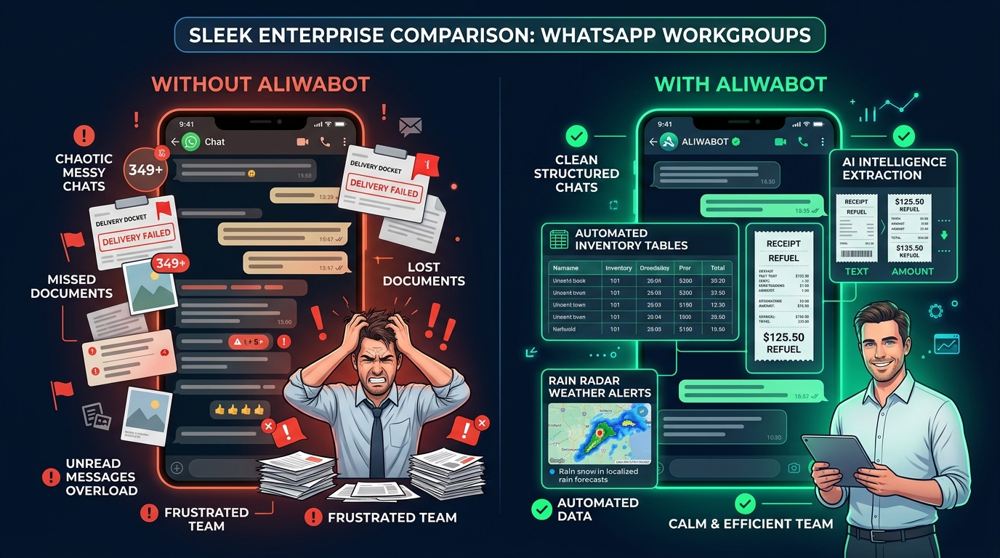
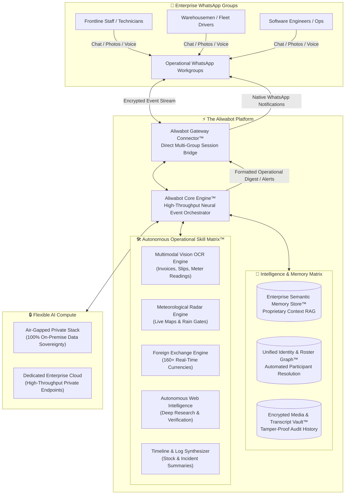

<div align="center">

# 🤖 Aliwabot
### *The Autonomous, Privacy-First AI Operational Co-Pilot for WhatsApp Workgroups*

[](#-the-aliwabot-engine-architecture)
[](#-enterprise-privacy--data-sovereignty)
[](#-the-commercial-math--as-a-service-roi)
[](#-24-hours-in-the-life-of-an-aliwabot-powered-operation)

<br/>


<p align="center">
  <b>Stop fighting human nature. Don't force your frontline teams to learn another complex software.</b><br/>
  Transform the messy WhatsApp groups your staff already use 50 times a day into structured, searchable, and auditable operational hubs.
</p>

---

[The Global Reality](#-act-i-the-33-billion-market-reality) • 
[The 7:45 AM Breakdown](#-act-ii-the-745-am-breakdown) • 
[The Transformation](#-act-iii-the-transformation--before-vs-after) • 
[24-Hour Walkthrough](#-act-iv-24-hours-in-the-life-of-an-aliwabot-powered-operation) • 
[Industry Deep Dive](#-act-v-deep-dive-across-5-operational-frontlines) • 
[Architecture](#-act-vi-the-aliwabot-engine-architecture) • 
[Commercial ROI](#-act-vii-the-commercial-math--as-a-service-roi) • 
[Command Suite](#-command-suite)

---

</div>

<br/>

## 📈 Act I: The 3.3 Billion Market Reality

Why build operational intelligence inside WhatsApp instead of asking workers to download another mobile app? **The data tells an undeniable story:**


<br/>

### 🌐 1. Global Dominance & Engagement
| Global Operational Metric | Verified Statistic | Visual Scale & Penetration |
| :--- | :--- | :--- |
| **Monthly Active Users (MAU)** | **3.3+ Billion** | `████████████████████` *1 in every 2.4 humans on Earth* |
| **Daily Active Users (DAU)** | **2.3+ Billion** | `██████████████░░░░░░` *70% of user base opens WhatsApp daily* |
| **Daily Message Volume** | **140+ Billion** | `████████████████████` *#1 dominant channel in 100+ nations* |
| **Active Business Users** | **760+ Million** | `██████████░░░░░░░░░░` *Monthly active business accounts* |

---

### 🏗️ 2. The 80% "Deskless Workforce" Paradox
> **Over 80% of the world’s working population (2.7 Billion frontline workers)** operates without a desk—in warehouse bays, construction sites, commercial plant rooms, and delivery vehicles. 
> 
> Yet, less than **1% of historical enterprise software venture capital** was designed for mobile frontline workers. Traditional ERP, CMMS, and ticketing apps fail on the ground because field staff refuse to navigate complex multi-screen forms.

```
Frontline Software Adoption Rate Reality:
WhatsApp Group Chats:    ████████████████████  98%  (Familiar, instant, zero learning curve)
Dedicated ERP/CMMS Apps: ███░░░░░░░░░░░░░░░░░  18%  (High friction, complex logins, abandoned)
```

* **The $41.4 Billion Frontline Opportunity**: The global Conversational AI market is projected to reach **$41.39 billion by 2030** (23.7% CAGR, Grand View Research). Frontline automation—bringing intelligence directly to the chat interfaces field crews already trust—is the highest-ROI frontier in enterprise technology.

---

## ⚡ Act II: The 7:45 AM Breakdown

Every operations manager, site superintendent, and business owner knows this exact feeling:

> **It’s 7:45 AM. Your phone is already vibrating across your desk with 349 unread messages across 14 different WhatsApp workgroups.**

* A warehouse forklift operator drops a photo of crumpled boxes: *"Received Bay 3, some damaged."* No item SKU, no quantity, no timestamp.
* A crane operator on the 24th floor asks: *"Can we lift the rebar bundle or is the thunderstorm hitting site in 15 mins?"*
* A property tenant sends a blurry photo of a leaking ceiling pipe with no location tag.
* A cross-border supplier messages in Vietnamese asking for payment confirmation, while your finance manager is calculating exchange rates in Excel.
* A developer dumps a 60-line terminal stack trace into the tech chat during an outage.

### The Expensive Consequence:
1. **Chat Log Amnesia**: After 400 messages, critical instructions and signed delivery slips vanish into the scroll abyss.
2. **The App Adoption Wall**: Management spent $35,000 rolling out a new mobile CMMS or project management tool. Three weeks later, the technicians and contractors stopped logging into it and secretly returned to WhatsApp.
3. **Disputes & Lost Revenue**: A subcontractor claims *"I posted the delivery docket in the chat last Tuesday!"* Searching through 2,000 photos takes 4 hours, and you end up eating a $3,500 replacement cost.

---

## 🔄 Act III: The Transformation — Before vs. After

What happens when you stop fighting human nature and embed an intelligent operational brain directly inside your existing WhatsApp groups?



<br/>

| Operational Challenge | ❌ Without Aliwabot (The WhatsApp Trap) | ✅ With Aliwabot (The Intelligent Hub) |
| :--- | :--- | :--- |
| **Shift Information** | 350+ unorganized chat bubbles; key updates buried | **Structured AI digests** generated automatically on schedule |
| **Stock Tracking** | Hours spent scrolling chat history to reconcile inventory | Single natural language query outputs a **clean movement table** |
| **Delivery Receipts** | Paper dockets lost in the mud or buried in camera rolls | Smartphone photos instantly converted to **digital text via OCR** |
| **Site Weather Safety** | Guesswork and generic phone weather apps | **High-resolution rain radar map snapshots** directly in chat |
| **Task Ownership** | Unacknowledged messages; masked `@lid` phone numbers | Resolves identities and triggers **audible native `@mentions`** |
| **Corporate Privacy** | Customer photos stored unencrypted on personal phones | **Encrypted local storage** with full on-premise data control |

---

## ⏱️ Act IV: 24 Hours in the Life of an Aliwabot-Powered Operation

Here is how Aliwabot quietly powers an entire enterprise's daily operational cycle without anyone ever leaving WhatsApp:


<br/>

### 🌅 07:30 AM — The Job Site: Meteorological Safety Gate
* **The Situation**: A 40-ton mobile crane is scheduled to lift precast concrete slabs at the downtown job site. Dark clouds are gathering on the horizon.
* **The Action**: The site engineer types in the group:  
  `!weather site radar`
* **The Result**: In 2 seconds, Aliwabot replies with a live meteorological rain radar map snapshot and a 2-hour localized precipitation forecast:  
  `⚠️ Rain Alert: Heavy convective rain band 8 km southwest, moving at 22 km/h. Estimated site arrival: 08:15 AM. Wind gusts: 34 km/h (Exceeds crane threshold of 30 km/h). Recommendation: Hold lifting operations until 09:30 AM.`  
  *Value Delivered: Averted a dangerous crane lift in high winds and avoided a $12,000 damaged concrete slab.*

---

### 📦 10:15 AM — The Warehouse: Delivery Docket & Mill Cert OCR
* **The Situation**: A haulage truck arrives at Bay 4 carrying 18 steel structural beams. The driver hands a grease-stained physical Delivery Order (DO) to the forklift driver.
* **The Action**: The forklift driver snaps a photo with his phone and posts it to the warehouse WhatsApp group.
* **The Result**: Aliwabot's vision engine instantly scans the image and posts a verified receipt card:  
  `📄 Delivery Docket Verified [DO-99214]:`<br/>
  `• Supplier: Apex Steel Industries`<br/>
  `• Item: Universal Beams UB-305x165 (Grade S355JR)`<br/>
  `• Quantity: 18 Beams (Total Net Weight: 14,240 kg)`<br/>
  `• Status: Logged to Inward Inventory Record.`  
  *Value Delivered: Zero manual typing errors, instant audit trail, and proof of receipt permanently logged.*

---

### 📊 02:00 PM — The Operations Desk: Natural Language Inventory Search
* **The Situation**: The logistics coordinator receives an urgent call from a major client asking if their pallet shipment has dispatched.
* **The Action**: Instead of calling 4 warehouse workers on the radio, the coordinator asks the group:  
  `@Aliwabot summarize stock movements for Bay 4 today`
* **The Result**: Aliwabot analyzes all morning chat messages and outputs a structured delta table:  
  `📦 Inventory Movement Summary — Bay 4 (Today):`<br/>
  `• Inward: 18 Universal Beams (DO-99214 via Apex Steel @ 10:15 AM)`<br/>
  `• Outward: 6 Pallets Grade-A Timber dispatched on Truck B-9021 @ 11:40 AM`<br/>
  `• Returned: 2 damaged crates SKU-402 staged for supplier inspection.`  
  *Value Delivered: 4-second instant answer. Client impressed. Zero radio interruptions.*

---

### 🏢 05:45 PM — Commercial Facilities: Defect Logging & Smart Dispatch
* **The Situation**: A security guard patrolling the 8th floor of an office tower spots water leaking from an overhead fan coil unit (FCU) near the server room.
* **The Action**: The guard snaps a photo of the leaking ceiling and serial tag and posts it: *"Water dripping near server room door."*
* **The Result**: Aliwabot registers the defect, cross-references building equipment records, and triggers a native audible `@mention` on the duty HVAC contractor's phone:  
  `🚨 Defect Ticket #284 Logged — FCU-08 Water Ingress`<br/>
  `• Asset: Daikin FCU Unit #08-B (Server Room Corridor)`<br/>
  `• Severity: HIGH (Proximity to electrical riser)`<br/>
  `• Action Assigned: @Contractor_Rahman please inspect condensate drain pan immediately.`  
  *Value Delivered: Instant push notification to the right specialist. No forgotten tickets. Server room protected.*

---

### 🌙 09:30 PM — The Shift Handover: Automated Executive Digest
* **The Situation**: The day shift is clocking out. The night shift supervisor needs to know exactly what remains pending across 12 different mechanical and logistics tasks.
* **The Action**: The outgoing supervisor types:  
  `!summary shift`
* **The Result**: Aliwabot scans the entire 12-hour chat transcript and generates a complete shift handover report categorized into Resolved Items, In-Progress Works, and High-Priority Alerts.  
  *Value Delivered: 45 minutes of manual report typing eliminated every evening.*

---

## 🏭 Act V: Deep Dive Across 5 Operational Frontlines


---

### 🚚 1. Logistics, Warehousing & Fleet Operations
* **Stock In / Stock Out Chat Reconciliation**: Floor workers post quick notes as they load and unload trucks. Aliwabot reconstructs the movement log on demand, matching shipments against delivery dockets.
* **Driver & Fleet Movement Timeline Search**: Ask `@Aliwabot where is Truck 14?` $\rightarrow$ The engine parses customs checkpoint messages, driver location shares, and highway delay notices to give you an exact chronological journey timeline.
* **Mobile Bill of Lading & Weighbridge OCR**: Instant text extraction from crumpled delivery notes, customs stamps, and scale receipts.

---

### 💻 2. Working Tech Teams, IT Operations & DevOps
* **Automated Asynchronous Standup Digests**: Hybrid and remote engineering teams post daily bullet points across time zones. Aliwabot compiles an executive summary highlighting finished PRs, code reviews, and critical blockers.
* **Production Outage Incident Timeline Logging**: During a critical server downtime, engineers dump error stack traces, curl outputs, and mitigation notes into the chat. Afterward, typing `!incident summary` generates a complete, timestamped post-mortem report ready for stakeholders.
* **Internal Architecture & API Querying**: Ingest internal technical documentation, deployment guides, and API schemas. Engineers can ask `@Aliwabot what is the rate limit on our v2 webhook?` and receive exact answers with citations.

---

### 🛍️ 3. Online Businesses, Social Commerce & Sourcing
* **Real-Time Cross-Border FX Sourcing (`!fx`)**: Negotiate wholesale prices with overseas manufacturers across borders. Type `!fx 25000 rmb to sgd` or ask naturally for live spot rates with custom margin markups.
* **Bank Transfer & Payment Receipt OCR Verification**: Wholesale customers send screenshots of bank transfers or QR payments. Aliwabot scans the image, extracts the Transaction Reference Number, timestamp, and amount, preventing duplicate or forged payment slips.
* **Product Catalog & Wholesale FAQ**: Instant answers to customer inquiries regarding container volume capacities, wholesale tier pricing, and warranty terms.

---

### 🏢 4. Facilities Management & Building Maintenance
* **Photo-to-Work-Order Defect Logging**: Technicians snap photos of leaking valves, tripped breakers, or broken pumps. The bot logs the defect, tags the contractor with an audible `@mention`, and tracks resolution time.
* **Equipment Manual & Error Code Semantic Lookup**: Ingest chiller, elevator, generator, and fire system manuals into Aliwabot's semantic memory. A junior technician asks `@Aliwabot error code E-14 on Daikin VRV outdoor unit?` and receives step-by-step diagnostic guidance.
* **Shift Handover Reports**: Instant shift change summaries preventing miscommunication between day and night maintenance crews.

---

### 🏗️ 5. Construction Sites & Civil Engineering Projects
* **Live Rain Radar Map & Lifting Safety Gates (`!weather`)**: Direct radar map snapshots and localized precipitation forecasts in the site group before authorizing concrete pours or crane hoisting.
* **Concrete Batch Ticket & Slump Test OCR**: Instant data extraction from batch plant delivery dockets (batch time, concrete grade, slump, volume in m³) as the mixer arrives at the site gate.
* **Subcontractor Accountability**: The engine maps contractor identities even when WhatsApp masks their phone numbers, ensuring every instruction has a permanent paper trail.

---

## 📐 Act VI: The Aliwabot Engine Architecture

Aliwabot is built as an enterprise-grade, event-driven operational intelligence platform designed for absolute confidentiality, speed, and reliability.



---

## 🛡️ Enterprise Privacy & Data Sovereignty

| Feature | Consumer Chatbots / Cloud SaaS | **Aliwabot Solution** |
| :--- | :---: | :---: |
| **Data Residency** | ❌ Sent to third-party US cloud | 🛡️ **100% On-Premise / Firewalled** |
| **Meta Messaging Fees** | 💸 High per-message cloud fees | 🆓 **Zero Meta Fees (Direct Connector)** |
| **Group Chat Integration** | ❌ Restrictive / Bot must be invited | 👥 **Native Multi-Group Participant** |
| **Document Confidentiality** | ❌ Blueprints/receipts stored on SaaS | 🔒 **Encrypted Local Storage** |
| **Air-Gapped Deployment** | ❌ Not available | 🏢 **Full Local Server Support** |

---

## 💼 Act VII: The Commercial Math & "As-a-Service" ROI

Investing in Aliwabot delivers immediate, measurable bottom-line returns:

### 1. Hard Return on Investment (ROI)
* **Supervisor Administrative Savings**: Eliminating 10–15 hours weekly spent manually transcribing and compiling chat reports saves an estimated **$1,200 to $2,000 per supervisor monthly**.
* **Dispute & Rejected Material Prevention**: In logistics and construction, a single disputed delivery docket or rejected concrete batch costs **$1,500 to $5,000**. Having a permanent, timestamped OCR log in WhatsApp eliminates disputes before they escalate.
* **Zero Software Training Costs**: 100% of employees already know how to use WhatsApp. Zero budget spent on software onboarding, user licenses, or adoption training.

### 2. Commercial Packaging Models

#### A. Managed Operational Co-Pilot (Turnkey Retainer)
* **Target Audience**: Facility management agencies, mid-sized builders, warehouse operators, e-commerce distributors.
* **Deployment**: Hosted on a dedicated private virtual machine or on-premise edge appliance.
* **Pricing Structure**:
  * **Onboarding & Manual Ingestion**: One-time setup ($500 – $1,200).
  * **Monthly Retainer**: **$150 – $350 / month per active operational group or site**.
  * **Zero Variable Costs**: No per-message API bills; unlimited team members and messages.

#### B. Air-Gapped Private Enterprise Edition
* **Target Audience**: Critical infrastructure, defense contractors, government-linked entities.
* **Deployment**: 100% on-premise execution on local enterprise hardware with local neural models.
* **Pricing Structure**: **Enterprise license + customized integration & maintenance retainer**.

---

## 🎮 Command Suite

| Command | Usage | Description |
| :--- | :--- | :--- |
| `!summary` | `!summary [shift\|bay3\|truck12]` | Reconstructs conversation history into a structured operational digest. |
| `!weather` | `!weather [location] [radar]` | High-resolution rain radar map snapshot, 2-hr forecast, and wind alerts. |
| `!ocr` | `!ocr` *(reply to photo)* | Extracts verbatim text and numbers from delivery dockets, slips, or serial tags. |
| `!fx` | `!fx <amount> <from> to <to>` | Live currency spot rate conversion across 160+ fiat currencies. |
| `!s` | `!s <query>` | Deep web research for port notices, customs tariffs, or technical datasheets. |
| `!url` | `!url <link>` | Synthesizes technical articles, supplier catalogs, or regulatory updates. |
| `!history`| `!history [stats\|purge]` | Inspects encrypted media archives and audit trail retention policies. |
| `!tools` | `!tools [on\|off]` | Enables autonomous multi-step tool execution in the group. |
| `!flush` | `!flush context` | Clears short-term conversational context to reset discussion focus. |
| `!help`  | `!help` | Dynamic menu showing all active operational skills. |

---

<div align="center">
  <sub>Engineered for demanding, real-world operational environments.</sub><br/>
  <b>© 2026 Aliwabot Project. All rights reserved.</b>
</div>
