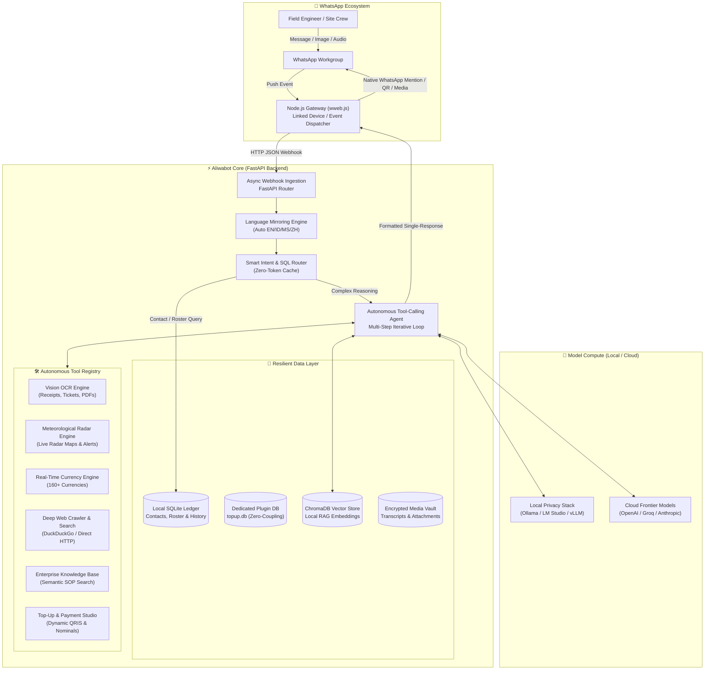
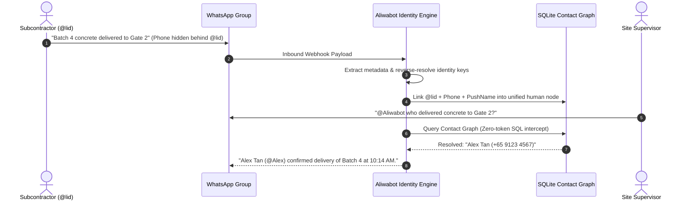

<div align="center">

# 🤖 Aliwabot
### *The Autonomous, Privacy-First WhatsApp AI Teammate for High-Velocity Professional Teams & Field Operations*

[](https://www.python.org/)
[](https://fastapi.tiangolo.com/)
[](https://nodejs.org/)
[](https://www.trychroma.com/)
[](https://ollama.ai/)
[](LICENSE)

<br/>


<p align="center">
  <b>Transform noisy WhatsApp project groups into organized, searchable, and intelligent operational hubs.</b><br/>
  Powered by Local LLMs (Ollama, LM Studio, vLLM) & Cloud AI (OpenAI, Groq), Local RAG, Vision OCR, Real-Time Weather Radar, and an Unmatched Contact Identity Graph.
</p>

---

[Key Highlights](#-why-aliwabot) • 
[Industry Use Cases](#-built-for-high-stakes-industries) • 
[Architecture](#-system-architecture) • 
[Core Capabilities](#-flagship-capabilities) • 
[Comparison](#-how-aliwabot-compares) • 
[Commands](#-command-suite)

---

</div>

<br/>

## 🌟 Why Aliwabot?

Most AI bots are simple toy wrappers designed for generic chatbots. They hallucinate in group chats, leak sensitive enterprise communications to public cloud APIs, stumble when users speak multiple dialects, and fail completely when confronted with WhatsApp's privacy masking.

**Aliwabot is built from the ground up for mission-critical working groups.** 

Whether you are coordinating high-rise concrete pouring under shifting tropical storms, managing a 12-hour offshore drilling shift handover, or tracking multi-currency procurement shipments across Southeast Asia, Aliwabot sits natively in your WhatsApp chatgroups as a **tireless, precision-engineered technical co-pilot**.

---

## 🏭 Built for High-Stakes Industries


### 🏗️ 1. Civil Engineering & Construction Management
* **Rain Radar & Critical Weather Gates**: Never risk a concrete pour or mobile crane lift. Call `!weather` or ask the bot in natural language to receive high-resolution rain radar map snapshots, 24-hour meteorological breakdowns, and PSI/temperature alerts directly in the site WhatsApp group.
* **On-Site Multimodal OCR (`ocr_extract`)**: Field engineers can snap a smartphone photo of delivery orders (DO), concrete batch plant delivery tickets, structural rebar test certificates, or equipment serial tags. Aliwabot extracts verbatim text and values instantly, eliminating manual typing errors.
* **Subcontractor Standup Synthesis**: Summarize hundreds of daily WhatsApp chats between MEP, structural, and finishing subcontractors into a coherent, structured **Daily Site Progress Report** with punch-list action items.
* **Blueprint & Specification RAG**: Ingest project technical specifications, approved method statements, and safety protocols into Aliwabot's local Knowledge Base. Field staff can tag `@Aliwabot` to verify minimum rebar overlap lengths or curing times without hunting through PDF binders in the site office.

---

### 🛢️ 2. Oil & Gas, Petrochemical & Offshore Plants
* **12-Hour Shift Handover Synthesis**: Offshore platform crews and refinery operators communicate continuous updates on WhatsApp. Aliwabot distills 12-hour chat logs into structured handovers: active **Permit-to-Work (PTW)** statuses, valve isolations, ongoing hot work, and equipment telemetry anomalies.
* **Air-Gapped, Zero-Leakage Privacy**: Oil & gas schematics and facility incidents are confidential trade secrets. Aliwabot operates **100% on-premise** using local vision and language models (Ollama / vLLM / LM Studio). No proprietary logs or prompts ever leave your firewalled local network.
* **Emergency HSE & SOP Retrieval**: During an alert or equipment trip, crews need answers in seconds. Aliwabot performs semantic search over local emergency response procedures, Material Safety Data Sheets (MSDS), and P&ID documentation.
* **Multilingual Field Sync**: In offshore environments where engineers, technicians, and foreign specialists interact across English, Bahasa Indonesia, Malay, and Chinese, Aliwabot automatically detects the incoming message's language and replies with native nuance—completely immune to language drift.

---

### 💼 3. Logistics, Supply Chain & Field Trading
* **Real-Time FX & Multi-Currency Arbitrage (`!fx`)**: Instant conversion across 160+ ISO fiat currencies (`!fx 250000 myr to sgd`) with per-currency caching, quick-rate boards, and natural language tool triggers (`"how much is 15,000 USD in IDR today?"`).
* **Unbreakable Contact Identity Graph**: When dealing with hundreds of external freight forwarders, ship brokers, and customs agents, WhatsApp masks identities behind `@lid` hashes. Aliwabot unifies phone numbers, names, and cryptic IDs into a permanent identity graph so you always know who said what.
* **Autonomous Deep Web Research (`!s`, `!url`)**: Investigate port congestion notices, customs tariff revisions, or live marine vessel coordinates through agentic multi-step web crawls without leaving WhatsApp.

---

## 📐 System Architecture

Aliwabot is architected as an asynchronous, event-driven distributed system comprising a high-performance Python FastAPI intelligence core coupled with an isolated Node.js WhatsApp Web gateway.



---

## 📇 Flagship Capabilities

### 1. Contact Harvesting & Identity Resolution Engine
WhatsApp groups frequently hide phone numbers behind privacy tokens (`@lid`), creating anonymous chaos in contractor groups. Aliwabot's identity pipeline solves this:
* **Background LID Scanner**: Proactively parses message metadata, participant join events, and profile status updates.
* **4-Stage Identity Merge Pipeline**: Unifies `@lid`, `@s.whatsapp.net`, raw phone numbers, and push names into a single normalized identity record in SQLite.
* **Smart Native Mentions**: When the AI references a team member by name (e.g., *"@Alex please confirm rebar delivery"*), a regex engine translates the text name into a true WhatsApp JID mention, triggering an audible push notification on the user's phone.



---

### 2. Autonomous Multi-Step Tool Calling (`!tools`)
Aliwabot does not just generate static text. When tool-calling is activated, the model plans, evaluates, and triggers multiple tools in a single conversational turn:
1. **Reads user prompt**: *"Can we pour concrete at the Jurong yard at 3 PM today, and what's the cost of 5,000 USD in SGD?"*
2. **Step 1**: Invokes `get_weather` with location `Jurong` $\rightarrow$ parses live rain radar and forecast.
3. **Step 2**: Invokes `convert_currency` with `5000 USD to SGD` $\rightarrow$ computes latest rate.
4. **Step 3**: Synthesizes a unified, formatted response with radar map attachment and clear actionable safety guidance.

---

### 3. Enterprise Web Dashboard & AI Studio (`/dashboard`)
Manage your entire fleet of WhatsApp bots from a sleek, responsive browser control plane:
* **Inline QR & Multi-Session Switcher**: Scan linked-device QR codes right in the browser, back up sessions, or hot-swap phone numbers without terminal restarts.
* **Database & Ledger Inspector**: Explore SQLite chat histories, contact rosters, and order ledgers with search filters, sticky headers, and CSV exports.
* **AI Assistant Studio**: An isolated browser-native AI assistant that queries local knowledge bases, inspects server health, and reviews transcripts with zero blast radius on the live bot runtime.
* **Automated Retention & Archival**: Configure automated retention policies for chat history and media (`!history`) with deduplication across shared storage inodes.

---

## 📊 How Aliwabot Compares

| Feature | Standard Toy Chatbots | Cloud SaaS WhatsApp Bots | **Aliwabot** |
| :--- | :---: | :---: | :---: |
| **Privacy & Data Residency** | ❌ Sent to 3rd party | ❌ Cloud vendor lock-in | 🛡️ **100% On-Premise / Local LLMs** |
| **WhatsApp `@lid` Resolution** | ❌ Blind to hidden IDs | ❌ Fails on privacy | 📇 **Full Identity Graph Engine** |
| **Vision OCR for Field Docs** | ❌ No vision support | ⚠️ Expensive per-call API | 👁️ **Local Vision / OCR.space Built-in** |
| **Meteorological Rain Radar** | ❌ Text-only weather | ❌ Third-party widget | 🌧️ **Live Radar Map Image Fusion** |
| **Long-Term Memory (RAG)** | ❌ Stateless / Single Turn | ⚠️ Basic message buffer | 🧠 **Local ChromaDB Semantic Vector RAG** |
| **Language Drift Immunity** | ❌ Drifts to English | ⚠️ Static system prompts | 🗣️ **Asymmetric Language Mirroring** |
| **Enterprise Web Dashboard** | ❌ Terminal only | ⚠️ Paywalled cloud portal | 🖥️ **Full-Featured Local Browser Suite** |
| **Cost Per Message** | 💸 High cloud token bills | 💸 Per-conversation pricing | 🆓 **Zero Recurring API Costs (Local Mode)** |

---

## 🎮 Command Suite

Aliwabot provides an intuitive, role-gated CLI command suite right inside WhatsApp:

| Command | Subcommands / Usage | Description |
| :--- | :--- | :--- |
| `!weather` | `!weather [location] [tomorrow]` | Live temperature, 2-hr forecast, 24-hr breakdown, and radar map snapshot. |
| `!ocr` | `!ocr` *(reply to image/PDF)* | Optical Character Recognition for receipts, site dockets, and serial tags. |
| `!fx` | `!fx <amount> <from> to <to>` | Real-time foreign exchange conversion across 160+ currencies. |
| `!s` | `!s <query>` | Agentic deep web search with live source citations. |
| `!url` | `!url <url> [depth]` | Recursive URL crawler and technical content synthesizer. |
| `!history`| `!history [stats\|purge\|retention]` | Transcripts & media capture status and storage cleanup policies. |
| `!tools` | `!tools [on\|off]` | Toggle autonomous AI tool execution in the current group. |
| `!flush` | `!flush context` | Instantly flush hallucinated context or corrupted RAG memories. |
| `!plugin`| `!plugin [enable\|disable] <name>` | Per-group or global toggle for any modular feature. |
| `!topup` | `!topup [buy\|price\|status]` | Merchant guest checkout with instant dynamic QRIS and custom nominals. |
| `!help`  | `!help` | Dynamically generated menu showing active plugins and commands. |

---

## 🚀 Quickstart & Deployment

Aliwabot is engineered for rapid deployment on on-premise workstations, local edge servers, or secure private cloud VMs.

### Prerequisites
* **Operating System**: Linux (Ubuntu 22.04+ recommended), Windows 11/Server, or macOS.
* **Runtimes**: Python 3.12+ and Node.js 18+.
* **Compute (Optional for Local Mode)**: NVIDIA GPU with 8GB+ VRAM for local Ollama/vLLM inference, or any standard CPU for Cloud API mode.

### 1. Clone the Repository
```bash
git clone https://github.com/cripperzprodigy/whatsapp-casual-bot.git
cd whatsapp-casual-bot
```

### 2. Configure Environment
```bash
cp .env.example .env
# Edit .env with your preferred LLM provider (Ollama, LM Studio, or OpenAI/Groq)
```

### 3. Launch Services
```bash
# Terminal 1: Launch FastAPI Core Backend
python -m venv venv
source venv/bin/activate  # On Windows: .\venv\Scripts\activate
pip install -r requirements.txt
uvicorn app.main:app --host 0.0.0.0 --port 8000

# Terminal 2: Launch WhatsApp Gateway
cd whatsapp-service
npm install
node index.js
```

### 4. Link WhatsApp
Open `http://localhost:8000/dashboard` in your browser and scan the displayed QR code using WhatsApp on your device (**Linked Devices** $\rightarrow$ **Link a Device**).

---

## 🔒 Security & Data Governance
* **Zero Telemetry**: Aliwabot does not transmit operational metrics or diagnostics to external servers.
* **CSRF & Rate Limiting**: All dashboard endpoints are protected by anti-CSRF token verification and strict origin checks.
* **Hermetic Test Suite**: Over 200+ unit and integration tests ensure rock-solid stability before any production deployment.

---

<div align="center">
  <sub>Engineered with precision for demanding professional environments.</sub><br/>
  <b>© 2026 Aliwabot Project. All rights reserved.</b>
</div>
